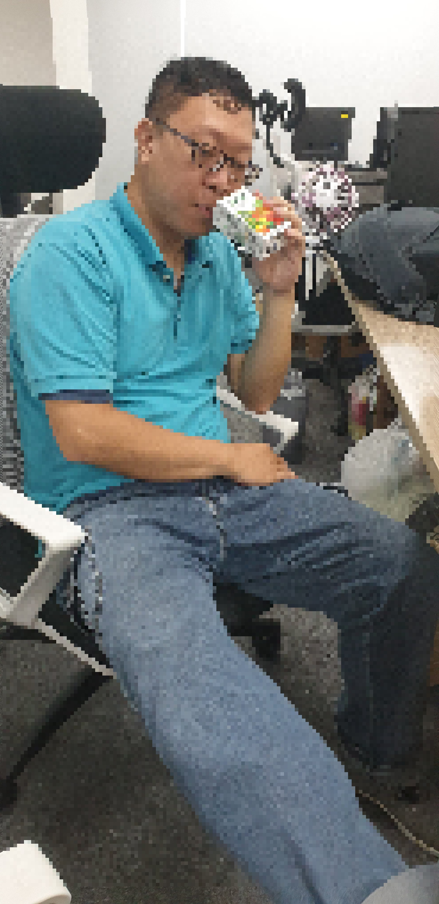

# 上班遊搞笑遊戲
目前還在發想劇情腳本，想到什麼就記下來，當作開發時可用素材，目前先以時段來區分，待後續更清楚思路再調整。
遊戲關卡設計讓同事丟臉...，謝謝同事的照片害我一直想玩弄他。

  

## 上班時
### 開會
### 被上司罵
### 同事不合
### 同事八卦
### 工作無聊
### 沒精神
### 臨時交辦事項
### 工作做不完
### 加班
-------------

## 上班起床
### 鬧鐘
### 刷牙洗臉
### 化妝
### 不想上班，想請假
### 被雜事擔誤時間
### 手忙腳亂
### 上廁所
### 東西忘了帶
### 吃早餐
-------------

## 上班途中
### 搭公車
### 搭計乘車
### 地鐵
### 腳踏車
### Scooter
### 趕打卡
### 趕電梯
-------------

## 吃飯
### 要吃什麼
-------------
